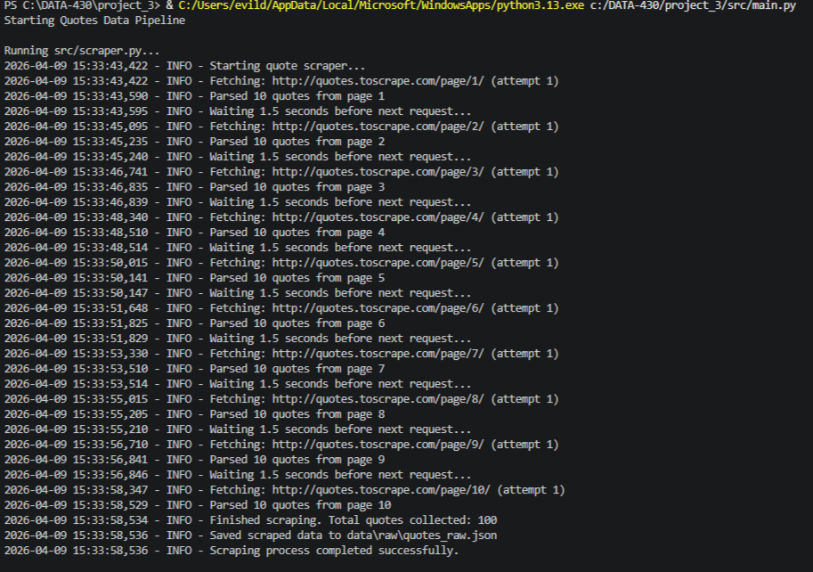
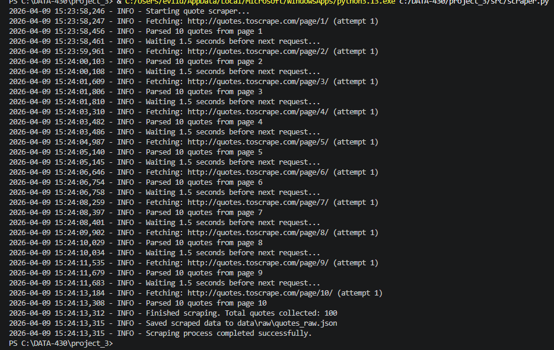
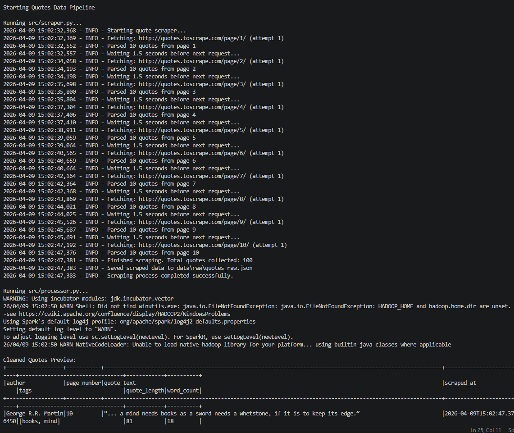
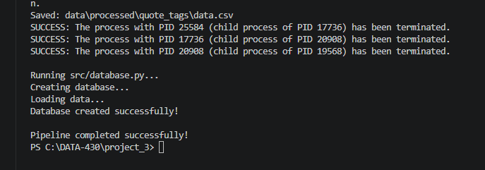
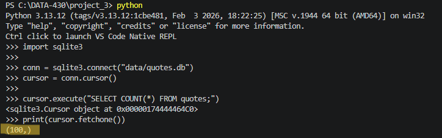

DATA-430 Project 3 — Quotes Data Pipeline
Project Overview

This project implements an end-to-end data pipeline that:
    1.Scrapes quotes from a public website
    2.Processes and cleans data using PySpark
    3.Transforms data into normalized tables
    4.Stores the processed data in a SQLite database
    5.Runs the entire workflow through a single pipeline script

This project demonstrates a complete ETL (Extract, Transform, Load) pipeline using Python, PySpark, and SQLite.

Project Structure

project_3/
│
├── data/
│   ├── raw/
│   │   └── quotes_raw.json
│   ├── processed/
│   │   ├── quotes/
│   │   ├── authors/
│   │   ├── tags/
│   │   └── quote_tags/
│   └── quotes.db
│
├── src/
│   ├── scraper.py
│   ├── processor.py
│   ├── database.py
│   └── main.py
│
├── screenshots/
├── requirements.txt
└── README.md

Technologies Used:
   - Python
   - PySpark
   - SQLite
   - Pandas
   - BeautifulSoup
   - Requests

Setup Instructions:
1. Clone Repository
git clone <https://github.com/vcelebrezze89/data430_project3.git>
cd project_3
2. Install Dependencies
pip install -r requirements.txt
3. Install Java (Required for PySpark)
    PySpark requires Java 17.

Running the Pipeline:

    To run the entire pipeline:
    python src/main.py
    This will:
    -Scrape quotes
    -Process data using PySpark
    -Create database
    -Load processed data into SQLite
    
Expected Output:
    After running the pipeline, the following files will be created:

            data/
            ├── raw/
            │   └── quotes_raw.json
            ├── processed/
            │   ├── quotes/data.csv
            │   ├── authors/data.csv
            │   ├── tags/data.csv
            │   └── quote_tags/data.csv
            └── quotes.db

Database Schema:
    
    Authors Table:
        Column	    Type
        author_id	INTEGER
        author	    TEXT
    Quotes Table:
        Column	    Type
        quote_id	INTEGER
        quote_text	TEXT
        author	    TEXT
       page_number	INTEGER
        scraped_at	TEXT
       quote_length	INTEGER
        word_count	INTEGER
    Tags Table:
        Column	    Type
        tag_id  	INTEGER
        tag	        TEXT
    Quote Tags Table:
        Column	    Type
        quote_id	INTEGER
        tag_id	    INTEGER

Sample Queries:
    Count Quotes
        SELECT COUNT(*) FROM quotes;
    
    Get Quotes by Author
        SELECT quote_text
        FROM quotes
        WHERE author = 'Albert Einstein';
    
    Join Quotes and Tags
        SELECT q.quote_text, t.tag
        FROM quotes q
        JOIN quote_tags qt ON q.quote_id = qt.quote_id
        JOIN tags t ON qt.tag_id = t.tag_id;

Design Decisions:
    -PySpark used for scalable data processing
    -SQLite used for lightweight database storage
    -Normalized database schema implemented
    -Pipeline automation using main.py
    -Pandas used for saving CSV output to avoid Windows Spark write issues

Assumptions:
    -Website structure remains consistent
    -Internet connection available for scraping
    -Java installed for PySpark

Challenges Encountered:
    -Configuring PySpark on Windows
    -Handling Spark file write permissions
    -Setting Java environment variables
    -Building end-to-end pipeline automation

Demonstration Steps:

To demonstrate the project:

    1. Run Pipeline
        python src/main.py
    2. Verify Database
        data/quotes.db
    3. Run Sample Query
        SELECT COUNT(*) FROM quotes;

Screenshots:

Pipeline Execution
    

Scraper Output
    

PySpark Processing
    

Database Created
    

Database Query
    

Dependencies:
    See requirements.txt
